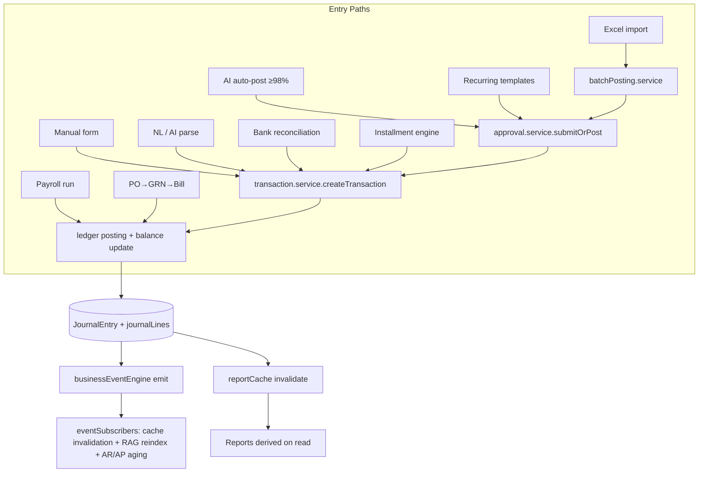

# 00 — Master Plan (Engineering Constitution)

| | |
|---|---|
| **Document** | 00_MASTER_PLAN.md |
| **Status** | Living / Authoritative |
| **Version** | 2.0.0 |
| **Applies to** | `vousfin-backend-main`, `vousfin-frontend-main` |
| **Last updated** | 2026-07-01 |
| **Supersedes** | 2.0.0 replaces the 1.0 draft that mis-described VousFin as a mobile-repair ERP. |

> This document is the root of the `docs/plans/` specification suite. It is descriptive of the system as built **and** prescriptive of how it must evolve. Where a lower-numbered document conflicts with a higher-numbered one on a matter the lower one owns, the owning document wins (see §9 Ownership Map). Where any document conflicts with the actual runtime behaviour of the code, the code is the ground truth and the document MUST be corrected via [CHANGELOG.md](./CHANGELOG.md).

---

## 1. Purpose

Define the shared engineering constitution for VousFin: what the product is, the non-negotiable invariants that protect financial correctness, the architecture every module obeys, and the workflow every contributor (human or AI) follows before changing code.

This suite is written to be executable by another engineer or an AI coding agent **without** asking clarifying questions. Every rule cites the file, function, or schema that enforces it so claims are verifiable against the codebase, not aspirational.

## 2. Scope

**In scope.** The VousFin backend accounting engine, database schema, domain model, transaction lifecycle, reporting, validation/integrity tooling, testing strategy, security, performance, the AI/NLP transaction pipeline, the synthetic dataset generator design, and the AI-agent development workflow.

**Out of scope.** UI visual design language (owned by the frontend design system), marketing content, deployment credentials, and any third-party service internals (Groq, Gemini, Brevo, Atlas). These are referenced where they constrain engineering decisions but not specified here.

## 3. What VousFin actually is

VousFin is an **enterprise-grade AI smart accountant for small and medium businesses** — a double-entry accounting platform with an AI/NLP front door, procurement (PO→GRN→Bill three-way match), AR/AP, inventory, tax (multi-country), payroll, fixed assets, installment/loan amortization, financial statements, forecasting, and a policy-governed automation layer.

It is **not** an industry-specific vertical ERP. There is no repair-order, technician, IMEI, multi-warehouse, branch, or point-of-sale module in the codebase, and none is planned as a core dependency. Inventory is a single per-business stock pool (`InventoryItem`), not a warehouse network. Any future vertical (retail, repair, manufacturing) MUST be built as a configurable module on top of the accounting core, never by forking accounting rules — see §10 Future Expansion.

### 3.1 Technology baseline (as built)

| Layer | Technology | Evidence |
|---|---|---|
| Backend runtime | Node.js + Express | `app.js`, `server.js` |
| Persistence | MongoDB + Mongoose | `models/*.model.js` (69 models) |
| Backend structure | controller → service → repository → model | `controllers/`, `services/` (126), `repositories/`, `models/` |
| Auth | Passport JWT + optional Google OAuth + TOTP MFA | `config/passport.js`, `middleware/auth.middleware.js`, `services/mfa.service.js` |
| Frontend | React 19 + Vite SPA | `vousfin-frontend-main/` |
| FE state | TanStack Query (server cache) + Zustand (7 stores) | `src/stores/`, `src/hooks/` (29 hooks) |
| AI | Groq (assistant/chat) + Gemini (NL parse) + Atlas `$vectorSearch` RAG with local-hash fallback | `services/nlParser/`, `services/vectorStore.service.js` |
| Deployment | Vercel serverless (backend + frontend), Atlas M0, cron-job.org for jobs, Brevo email | card-free free-tier stack |

## 4. First principles (ranked, non-negotiable)

The ordering is a decision rule: when two principles collide, the higher one wins.

1. **Correctness > Performance > Convenience.** A faster or cleaner implementation that can drift the trial balance is a failed implementation.
2. **One financial event → one accounting story.** Every event is represented exactly once. Reports are *derived* from journal records, never stored as independent competing state.
3. **Single source of truth per fact.** Business documents (Invoice/Bill) are authoritative for AR/AP; `JournalEntry` is the authoritative ledger; the `JournalEntry.journalLines[]` array is the authoritative ledger effect; `ChartOfAccount.runningBalance` is a *derived cache* reproducible from journals.
4. **Immutable financial history.** Posted journals, payments, audit logs, and events are never mutated or deleted. Corrections are new reversing/adjusting entries.
5. **One accounting engine, no side doors.** Every posting path (form, NL, Excel, AI auto-post, bank reconciliation, payroll, installments, procurement, recurring, reversal) converges on `transaction.service.createTransaction()` or `ledgerPosting.postCompoundJournal()`. No module posts to the ledger by any other mechanism.
6. **Explainability.** Every journal, balance, and report figure is traceable to an originating event with who/when/why/before/after.
7. **Generalize, never special-case.** No logic keyed to one business, one customer, one dataset, or one report.

## 5. Non-negotiable invariants (the "constitution")

These are enforced in code and verified by tests + the integrity gate. Violating any is a release blocker.

| # | Invariant | Enforced by |
|---|---|---|
| I1 | Every posted entry balances: Σ debits = Σ credits (to 2 dp) | `transaction.service.js` balance check; `ledgerPosting.postCompoundJournal()` |
| I2 | `debitAccountId ≠ creditAccountId` on 2-line entries | `JournalEntry` schema validator |
| I3 | Cached `runningBalance` == journal-derived balance (drift = 0) | `ledgerIntegrity.computeDrift()`; `scripts/ledgerDrift.js` |
| I4 | Posted financial fields (amount, accounts, journalLines, rate, tax) are immutable | `JournalEntry` pre-update immutability hook |
| I5 | No write into a LOCKED period; no non-system write into a CLOSED period | `AccountingPeriod` lock checks in schema + service |
| I6 | Corrections happen only via reversing/adjusting entries | `transaction.service.reverseTransaction()` |
| I7 | Every query is tenant-scoped by `businessId` | repository layer; verified by isolation tests |
| I8 | Historical FX rates are never overwritten | `JournalEntry.exchangeRate`/`baseCurrencyAmount` immutability |
| I9 | Journal + all running-balance updates commit atomically or all roll back | `utils/withTransaction.js` wrapping persist |
| I10 | AI never fabricates a ledger record; AI output is validated before posting | NL pipeline confidence + account resolution gates |

## 6. Architecture at a glance

- **Request pipeline** (`app.js`): helmet → CORS → compression → JSON(10mb) → cookie → passport → morgan → mongo-sanitize → rate-limit(`/api`) → `/api/v1` routes → 404 → global error handler.
- **Layering.** Controllers are thin (extract req/res, delegate, `ApiResponse.*`). Services own business logic and orchestrate repositories. Repositories extend `BaseRepository`. Models are Mongoose schemas.
- **Universal Transaction Pipeline.** See [04_TRANSACTION_LIFECYCLE.md](./04_TRANSACTION_LIFECYCLE.md) §2 for the canonical 12-stage flow every transaction traverses.

## 7. Module map (as built)

| Area | Key services | Key models | Spec section |
|---|---|---|---|
| Ledger core | `transaction`, `ledgerPosting`, `journalGenerator`, `ledgerIntegrity`, `partyBalance` | JournalEntry, ChartOfAccount | 01, 04 |
| AR | `invoice`, `creditNote`, `customerStatement`, `dunning`, `earlyPaymentDiscount` | Invoice, Customer, CreditNote | 03, 04, 09 |
| AP | `bill`, `billMatching`, `vendorCredit`, `payment`, `paymentReminder` | Bill, Vendor, VendorCredit, Payment | 03, 04, 09 |
| Procurement | `purchaseOrder`, `goodsReceipt`, `billMatching`, `procurementAnalytics` | PurchaseOrder, GoodsReceipt | 03, 04 |
| Inventory | `inventory`, `inventoryRecalc` | InventoryItem | 03, 04 |
| Tax | `taxEngine`, `taxPosition`, `taxReport`, `taxSnapshot`, `returnPrepare/Validate/Filing` | TaxReturn, TaxPositionSnapshot | 01, 04, 09 |
| Payroll | `payroll`, `payrollTax` | Employee, PayrollRun, PayrollAccrual | 03, 04 |
| Fixed assets / leases | `fixedAsset`, `impairment`, `leaseAccounting` | FixedAsset, Lease, ImpairmentCheck | 03, 04 |
| Installments/loans | `installment` | InstallmentPlan | 03, 04 |
| Periods/close | `accountingPeriod`, `fiscalYear`, `closeAgent` | AccountingPeriod, FiscalYear | 01, 04 |
| Reporting | `report`, `reportBuilder`, `arApReporting`, `cfoReport`, `narrative` | ReportTemplate | 09 |
| Forecasting | `services/forecasting/*` (LSTM, ETS, ensemble, drift, governance) | Forecast* models | 11 (perf notes) |
| AI/NLP | `nlParser/*`, `aiAssistant`, `ragQuery`, `vectorStore`, `anomalyDetection` | VectorDocument, SearchLog | 01, 07, 14 |
| Automation | `approval`, `autonomyPolicy`, `orchestrator`, `commandCenter`, agents | AutonomyPolicy, ProposedAction, PlanRun | 04, 07, 12 |
| Governance/security | `audit`, `sod`, `rbac`, `internalAudit`, `retention`, `compliance`, `amlScreening` | AuditLog, SodRule, RetentionPolicy | 12 |

## 8. The specification suite

| Doc | Title | Owns |
|---|---|---|
| 00 | Master Plan (this) | Principles, invariants, ownership, workflow |
| 01 | Accounting Engine Specification | Journal rules, CoA, posting, tax, FX, drift |
| 02 | Database Architecture | Schema, indexes, constraints, transactions, migrations |
| 03 | Business Domain Model | Every entity: lifecycle, relationships, rules |
| 04 | Transaction Lifecycle | Every business transaction end-to-end |
| 05 | Dataset Generator Specification | Synthetic data design + coverage matrix |
| 06 | Validation Engine | Self-verification of every ledger/report invariant |
| 07 | Self-Improvement Engine | Scenario→fail→root-cause→fix→regress loop |
| 08 | Edge Case Library | Enumerated edge cases + expected behaviour |
| 09 | Reporting Engine | Every report: source, filters, math, validation |
| 10 | Testing Strategy | Unit→integration→integrity gate→mutation |
| 11 | Performance & Scalability | Indexes, caching, concurrency, scale path |
| 12 | Security & Audit | RBAC, SoD, audit trail, retention, compliance |
| 13 | Release Standard | Definition of done, gates, checklist |
| 14 | AI Development Guidelines | Rules for AI coding agents |
| — | CHANGELOG.md | Every documentation change |

## 9. Ownership map (conflict resolution)

Each fact has exactly one owning document. When you need to change a fact, change it in the owner and add cross-references elsewhere.

| Fact class | Owner |
|---|---|
| Accounting rules, journal templates, drift definition | 01 |
| Schema fields, indexes, migration procedure | 02 |
| Entity lifecycle & relationships | 03 |
| Per-transaction end-to-end behaviour | 04 |
| Report math & data source | 09 |
| Test taxonomy & gates | 10 |
| Security controls | 12 |
| Release gates | 13 |

## 10. Future expansion (principles, not commitments)

Expansion is welcome but constrained. Any new vertical or module MUST:

1. Describe **business events**, never invent accounting. It emits events; the accounting engine (Doc 01) converts them to balanced journals.
2. Add its own models/services; never fork `transaction.service` or `ledgerPosting`.
3. Be **feature-flagged / config-driven** so businesses that don't use it are unaffected (precedent: `taxConfig`, `approvalSettings`, `aiSettings` all default to off).
4. Ship with tests proving the trial balance still nets to zero (Doc 10) and drift stays 0 (Doc 06).
5. Reuse control-account, period-lock, audit, and tenant-isolation infrastructure rather than re-implementing it.

Candidate future modules (unbuilt, illustrative): multi-warehouse inventory, POS/retail front, project/job costing expansion, multi-branch consolidation, bank feed aggregation, e-invoicing per jurisdiction.

## 11. AI & human development workflow (mandatory)

Before writing code, in order:

1. Read this document and the owning spec (§9) for the area you touch.
2. Search the repository for existing implementations and patterns — VousFin is large (126 services); the capability you need often already exists.
3. Identify the accounting impact, the authoritative data source, and downstream dependents (reports, events, aging, cache, audit).
4. Design; where accounting is involved, state the journal effect explicitly.
5. Write a failing test first (TDD is mandatory for accounting changes — Doc 10).
6. Implement the minimal change; keep the diff scoped.
7. Run the suite + `scripts/ledgerDrift.js` (must read 0) + build/lint.
8. Update the owning spec and CHANGELOG.
9. Commit per logical change; never bundle unrelated changes.

Full detail: [14_AI_DEVELOPMENT_GUIDELINES.md](./14_AI_DEVELOPMENT_GUIDELINES.md).

## 12. Definition of done (summary)

A change is done only when: business rules implemented; validation present; accounting correct and balanced; inventory correct; reports/aging/cache update; unit + regression tests green; drift = 0; security considered; errors handled; edge cases covered; docs + CHANGELOG updated. Full gate: [13_RELEASE_STANDARD.md](./13_RELEASE_STANDARD.md).

## 13. Failure modes this constitution prevents

| Failure | Prevented by |
|---|---|
| Trial balance drift after a crash mid-post | I9 atomic persist; I3 drift gate |
| Two modules posting the same event twice | I5 single engine; idempotency keys |
| Silent history rewrite | I4 immutability; I6 reversals only |
| Cross-tenant balance corruption | I7 tenant scoping; line-account validation |
| AI inventing an account/entry | I10 resolution + confidence gates |
| Reports disagreeing with the ledger | Principle 2 derive-don't-store |

## 14. Cross references

- Accounting rules → [01_ACCOUNTING_ENGINE_SPECIFICATION.md](./01_ACCOUNTING_ENGINE_SPECIFICATION.md)
- Schema/DB → [02_DATABASE_ARCHITECTURE.md](./02_DATABASE_ARCHITECTURE.md)
- Domain entities → [03_BUSINESS_DOMAIN_MODEL.md](./03_BUSINESS_DOMAIN_MODEL.md)
- Transaction flows → [04_TRANSACTION_LIFECYCLE.md](./04_TRANSACTION_LIFECYCLE.md)
- Testing/gates → [10_TESTING_STRATEGY.md](./10_TESTING_STRATEGY.md), [13_RELEASE_STANDARD.md](./13_RELEASE_STANDARD.md)

## 15. Revision history

| Version | Date | Change |
|---|---|---|
| 1.0 | 2026-07 (draft) | Initial draft (inaccurate: mobile-repair framing, escaped-markdown). Superseded. |
| 2.0.0 | 2026-07-01 | Rewritten from a full repository audit. Corrects business-domain framing to general SME accounting; grounds every claim in real files; adds invariant table, ownership map, module map. |

## 16. Progress checklist

- [x] Business domain corrected to match code
- [x] Invariants enumerated with enforcement sites
- [x] Module map cross-referenced to specs
- [x] Ownership/conflict-resolution rule defined
- [ ] All 16 companion documents ratified
- [ ] Integrity gate wired into CI (currently manual — see Doc 10)
