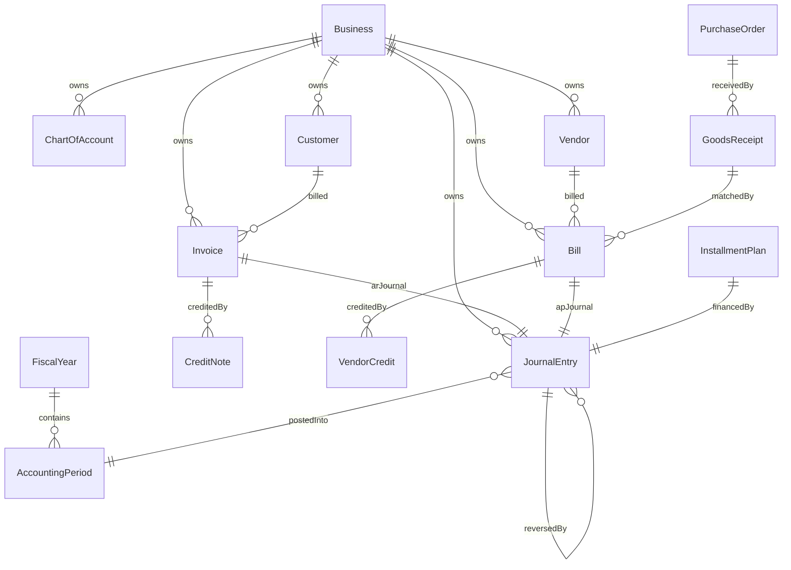

# 02 — Database Architecture

| | |
|---|---|
| **Status** | Living / Authoritative |
| **Version** | 2.0.0 |
| **Owner of** | Schema, indexes, constraints, transactions, concurrency, migrations |
| **Last updated** | 2026-07-01 |
| **Parent** | [00_MASTER_PLAN.md](./00_MASTER_PLAN.md) |

> The database is designed around **business concepts**, never UI convenience. MongoDB (Mongoose ODM). 69 models. Every financial collection is tenant-scoped, append-mostly, and reconcilable to a single source of truth.

---

## 1. Purpose & scope

Specify how VousFin persists data: entity ownership, relationships, indexing strategy, constraints, multi-document transactions, isolation, soft-delete, concurrency, and the migration procedure. Field-by-field entity documentation lives in [03_BUSINESS_DOMAIN_MODEL.md](./03_BUSINESS_DOMAIN_MODEL.md); this document owns the *architecture* of the store.

## 2. Definitions

| Term | Meaning |
|---|---|
| **Tenant** | A `Business` document; every financial record carries `businessId`. |
| **Source of truth** | The document that owns a fact (Invoice owns AR document state; JournalEntry owns the ledger; journalLines own the ledger effect). |
| **Projection** | A denormalized read-optimized copy reproducible from the source (e.g., `runningBalance`, top-level debit/credit pair). |
| **Soft delete** | `isArchived`/`status` flag; financial rows are never hard-deleted. |
| **Session** | A Mongoose/Mongo multi-document transaction context. |

## 3. Storage engine & driver

- MongoDB via Mongoose. Connection pooling tuned for serverless in `config/database.js` (`minPoolSize:1` warm socket, `maxPoolSize:10`, `maxIdleTimeMS:60000`).
- Production is Atlas M0 (shared) — single-node semantics for many ops; multi-document transactions require a replica set. `utils/withTransaction.js` uses `session.withTransaction` when available and **degrades to a non-atomic path once** on standalone servers (logged), so unit runs work without a replica set.

## 4. Ownership & single-source-of-truth map

| Fact | Owner collection | Projections |
|---|---|---|
| Ledger effect | `JournalEntry.journalLines[]` | top-level `debit/creditAccountId`,`amount` |
| Account balance | derived from journals | `ChartOfAccount.runningBalance` |
| AR document state | `Invoice` | `JournalEntry` (isProjection), `Customer.currentReceivableBalance` |
| AP document state | `Bill` | `JournalEntry` (isProjection), `Vendor.currentPayableBalance` |
| Cash movement + allocation | `Payment` (record) + settlement JEs (ledger) | `Invoice/Bill.paidAmount` |
| Stock quantity/valuation | `InventoryItem` | GL account 1150 balance |
| Period state | `AccountingPeriod`/`FiscalYear` | — |
| Immutable action history | `AuditLog`, `EventLog` | — |

**Rule.** A projection is always rebuildable from its owner. `scripts/recomputeLedgerBalances.js` rebuilds `runningBalance`; `projectionRebuild.service.js` rebuilds JE projections; `partyBalance` rebuild reconciles customer/vendor balances.

## 5. Relationships

MongoDB has no FK enforcement; relationships are `ObjectId` refs validated in the service/repository layer.

Referential integrity is enforced by: (a) service-layer existence checks, (b) tenant-membership validation (`findAllByBusinessAndIds` for journal-line accounts), (c) state-machine transition guards for document lifecycles.

## 6. Indexing strategy

Indexes are declared on the schema and are `businessId`-leading so every query is tenant-selective. Highlights (full set in Doc 03 per model):

**JournalEntry** (the hottest collection):
- `{businessId, transactionDate:-1, transactionType}` core listing
- `{businessId, transactionDate:-1, status}` (`idx_report_core`) reporting
- `{businessId, isArchived, transactionDate:-1, status}` (`idx_listing_sorted`)
- `{businessId, debitAccountId, transactionDate:-1, status}` + credit twin — general ledger
- `{businessId, customerId, remainingBalance, paymentStatus}` sparse — AR outstanding
- `{businessId, vendorId, remainingBalance, paymentStatus}` sparse — AP outstanding
- `{businessId, taxType, transactionDate:-1}` sparse, `{businessId, status, taxAmount, transactionDate:-1}` partial (taxAmount>0) — tax
- `{businessId, inventoryItemId, transactionDate}` partial — inventory ledger
- `{businessId, invoiceNumber}` unique sparse; `{description:'text'}` full-text
- AR/AP lifecycle indexes on `customerId`,`vendorId`,`paymentStatus`,`dueDate`,`installmentPlanId`,`parentTransactionId`

**ChartOfAccount:** `{businessId, accountName}` unique; `{businessId, accountCode}` unique sparse; `{businessId, accountType, accountName}`; `{accountName:'text'}` (NL/Excel fuzzy resolution); `isControlAccount`.

**Documents (Invoice/Bill/PO/GRN):** `{businessId, <number>}` unique sparse; `{businessId, state, <date>}`; `{businessId, party, state}`; approval and match-status indexes.

**Index rules.** (1) Every new query must be backed by a `businessId`-leading index. (2) Sparse/partial indexes for optional-field filters (tax, inventory, invoiceNumber). (3) Text indexes only where fuzzy search is a real requirement. (4) Never add a UI-shaped index that isn't a real access pattern.

## 7. Constraints

| Constraint | Mechanism |
|---|---|
| Unique account name / code per business | compound unique index |
| Unique document number per business | unique sparse index |
| Balanced journal | service validation (not a DB constraint) |
| `debit ≠ credit` | schema validator |
| Amount bounds & finiteness | schema `min` + service input hardening |
| Enum membership (status, type, mode) | schema `enum` |
| Immutable posted fields | pre-update middleware |
| Period lock | pre-save/update middleware |
| One live payroll run per period | partial unique index (status ≠ reversed) |
| One EOBI accrual per business-month | unique `{businessId, month}` |

## 8. Multi-document transactions & atomicity

- `utils/withTransaction.js` wraps ledger-affecting writes so the JE and every running-balance `$inc` commit together or roll back together (I9). Reversals wrap the reversal JE, balance updates, AR/AP rollback, and original-status flip in one session.
- **WriteConflict handling.** Mongo aborts losers on concurrent writes to the same document/balance. `session.withTransaction` retries transient conflicts internally. Bulk import adds an application-level **sequential recovery pass**: any row that failed the concurrent pass is retried single-threaded with a stable idempotency key (`sha256(businessId:batchId:index)`), so conflict-losers succeed and can never double-post (see Doc 04 §Excel).

## 9. Isolation & multi-tenancy

- **Hard rule (I7).** Every query filters by `businessId`. Repositories centralize this; `sanitizeAndValidateId` validates the id.
- Journal-line account IDs are validated against the tenant (`findAllByBusinessAndIds`) before posting — prevents a crafted payload from moving another tenant's balances.
- RAG vectors isolate tenant vs global via `VectorDocument.scope` + a reserved `GLOBAL_CATALOG_BUSINESS_ID` sentinel, so global catalog search never leaks tenant data.
- `express-mongo-sanitize` strips operator injection from request payloads at the edge.

## 10. Soft delete, versioning, audit

- **Soft delete.** Financial documents use `isArchived`/`archivedAt`/`archivedBy`; journals use `status` (never removed). Reversal — not deletion — is the correction path.
- **Versioning.** Salary structures (`Employee.salaryStructure[]`) and lifecycle histories (`stateHistory[]`, `fieldHistory[]`, `approvalChain[].history`) are append-only version trails. Vendor/customer snapshots on documents freeze the party at document time.
- **Audit.** `AuditLog` is append-only with schema hooks that throw on update/delete. `EventLog` records the append-only event stream. Retention governed by `RetentionPolicy` + `retention.service`.

## 11. Concurrency model

- Optimistic by default; correctness comes from atomic `$inc` + multi-doc transactions, not lock tables.
- Balance updates are atomic `$inc` operations (never read-modify-write in app code).
- Idempotency keys make retries safe across all posting paths.
- Sequence numbers (invoice/bill/payment) use atomic counters (`InvoiceCounter.findOneAndUpdate`) to avoid duplicates under concurrency.

## 12. Migrations

- Tooling: `migrate-mongo` (`migrate-mongo-config.js`) plus standalone backfill scripts run via npm (`migrate:backfill-payments`, `migrate:mark-projections`, `migrate:backfill-payment-records`, `migrate:backfill-accuracy`). Migration files live in `migrations/` (12 present; e.g. `backfill_account_subtypes_and_codes.js`, `mark_journal_projections.js`, `add_advanced_transaction_fields.js`, `20260602-add-timezone-fields.js`).
- **Migration rules.** (1) Additive and idempotent by default (re-runnable). (2) Never mutate posted financial fields. (3) Snapshot before destructive change; re-verify drift = 0 after. (4) Provide dry-run. (5) Prefer `syncMissingDefaults`-style additive backfills invoked on read over one-shot destructive migrations for reference data.

## 13. Business rules (DB-owned)

| ID | Rule |
|---|---|
| DB-01 | Every financial write is tenant-scoped and atomic where balances move. |
| DB-02 | Projections are rebuildable from their owner; never the sole source. |
| DB-03 | Audit/event logs are immutable (insert-only). |
| DB-04 | Uniqueness of account/document numbers is DB-enforced per tenant. |
| DB-05 | Migrations are additive, idempotent, drift-verified. |
| DB-06 | Optional-field filters must use sparse/partial indexes. |

## 14. Acceptance criteria

- [ ] A query without `businessId` fails code review / isolation test.
- [ ] Posting under simulated concurrent load leaves drift = 0 (recovery pass covers WriteConflicts).
- [ ] Attempting to update an `AuditLog` throws.
- [ ] Duplicate account code within a business is rejected by the unique index.
- [ ] A migration re-run is a no-op (idempotent).
- [ ] Rebuilding `runningBalance` from journals reproduces cached values (drift 0).

## 15. Failure modes

| Failure | Cause | Mitigation |
|---|---|---|
| Partial write (JE without balances) | Crash mid-transaction | `withTransaction`; drift gate catches residue |
| Cross-tenant leak | Missing `businessId` filter | Repository discipline; isolation tests |
| Duplicate document number | Race on sequence | Atomic counter |
| Unbounded collection growth | No retention | `RetentionPolicy` + retention job |
| Index bloat | UI-shaped indexes | Access-pattern review rule |

## 16. Regression requirements

Schema/index changes ship with: a migration (if data shape changes), an idempotency test for that migration, an isolation test if a new query is added, and a drift check if balances are involved.

## 17. Performance notes

See [11_PERFORMANCE_AND_SCALABILITY.md](./11_PERFORMANCE_AND_SCALABILITY.md). Key: `businessId`-leading compound indexes; `reportCache` for read-heavy statements; aggregation pipelines for reports (`$group`) not per-row app loops; `.lean()` for read projections; pagination on all list endpoints.

## 18. Security notes

Least-privilege DB user; network allow-list; sensitive fields (`mfa.secret`, `mfa.backupCodes`, `passwordHash`, `tokenBlacklist`, embeddings) excluded via `select:false`/`toJSON` transforms. Credential rotation is an operational TODO (see Doc 12). Detail: [12_SECURITY_AND_AUDIT.md](./12_SECURITY_AND_AUDIT.md).

## 19. Future expansion

Sharding by `businessId` (natural shard key) for horizontal scale; read replicas for reporting; time-series/archival tiering for aged journals; a dedicated analytics store fed by the event stream (Doc 11 §scale path).

## 20. Cross references

- Per-entity fields/indexes → [03_BUSINESS_DOMAIN_MODEL.md](./03_BUSINESS_DOMAIN_MODEL.md)
- Ledger semantics → [01_ACCOUNTING_ENGINE_SPECIFICATION.md](./01_ACCOUNTING_ENGINE_SPECIFICATION.md)
- Scale & indexing → [11_PERFORMANCE_AND_SCALABILITY.md](./11_PERFORMANCE_AND_SCALABILITY.md)

## 21. Revision history

| Version | Date | Change |
|---|---|---|
| 1.0 | 2026-07 (draft) | Generic template. Superseded. |
| 2.0.0 | 2026-07-01 | Rewritten from audit: real ownership map, index catalog, transaction/concurrency model, migration inventory. |

## 22. Progress checklist

- [x] Ownership / source-of-truth map
- [x] Index strategy from real schema
- [x] Transaction + WriteConflict recovery model
- [x] Migration tooling + rules
- [ ] Shard-key + analytics-store plan (future)
