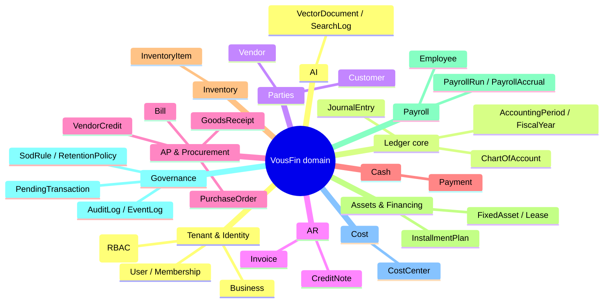

# 03 — Business Domain Model

| | |
|---|---|
| **Status** | Living / Authoritative |
| **Version** | 2.0.0 |
| **Owner of** | Every domain entity: purpose, lifecycle, relationships, rules |
| **Last updated** | 2026-07-01 |
| **Parent** | [00_MASTER_PLAN.md](./00_MASTER_PLAN.md) |

> This document is the canonical inventory of VousFin's domain entities (69 Mongoose models). It records what exists, its lifecycle, its relationships, and its business rules. Where a "classic ERP" concept is **not** modelled, that is stated explicitly so nobody builds a phantom feature.

---

## 1. Purpose & scope

Give an implementer a complete, unambiguous map of the domain so they can extend it without re-reading every model file. Schema architecture (indexes, transactions) is owned by [02_DATABASE_ARCHITECTURE.md](./02_DATABASE_ARCHITECTURE.md); accounting semantics by [01_ACCOUNTING_ENGINE_SPECIFICATION.md](./01_ACCOUNTING_ENGINE_SPECIFICATION.md); per-transaction flows by [04_TRANSACTION_LIFECYCLE.md](./04_TRANSACTION_LIFECYCLE.md).

## 2. What is NOT modelled (avoid phantom features)

| Classic ERP concept | Status in VousFin | Nearest actual concept |
|---|---|---|
| Repair order / work order | **Not present** | — |
| Technician / labour dispatch | **Not present** | `Employee` (payroll only) |
| IMEI / serial tracking | **Not present** | `InventoryItem.sku`/`barcode` (no per-unit serial) |
| Multi-warehouse network | **Not present** | Single per-business stock pool (`InventoryItem`) |
| Branch / multi-location | **Not present** | One `Business` per user |
| Project / job costing (full) | **Partial** | `CostCenter` tagging; `jobCosting.service` (light) |
| Point of sale | **Not present** | Cash Sale transaction type |
| Bank account entity | **Modelled as CoA** | Cash/bank `ChartOfAccount` (1010–1045) |

Any of these MUST be added as an additive module per [00_MASTER_PLAN.md](./00_MASTER_PLAN.md) §10 — never by forking accounting rules.

## 3. Entity clusters

---

## 4. Tenant & identity

### Business
**Purpose.** The tenant root; one per user. Holds currency, fiscal config, and feature toggles (`taxConfig`, `approvalSettings`, `aiSettings`), all default-off so existing tenants are unaffected until enabled.
**Key fields.** `userId` (unique), `businessName`, `businessType`, `currency`, `reportingCurrency`, `fiscalYearStartMonth`, `taxConfig{country,gstEnabled,vatEnabled,whtEnabled,customRates,...}`, `approvalSettings{enabled,threshold,allowSelfApproval}`, `aiSettings{autoPostEnabled}`.
**Lifecycle.** Created via setup wizard → seeds 82 default accounts → operational. Immutable base currency after first transaction (changing it would invalidate history).
**Relationships.** Owns all financial collections. `hasSufficientHistory(months)` gates AI features.
**Rules.** One business per user; feature toggles opt-in; base currency is functional currency of the ledger.

### User, Membership, RBAC
**User.** Auth identity: `email` (unique), `passwordHash` (null for OAuth), `authProvider` (local/google), `role` (admin/customer), `status`, `mfa{enabled,secret,backupCodes}` (secret/codes `select:false`), `tokenBlacklist` (logout). **Membership** binds users to a business with a role for team access. **Role/Permission** back the RBAC middleware.
**Rules.** MFA secret never leaves the server; JWTs blacklisted on logout; least-privilege role checks in `rbac.middleware`.

---

## 5. Ledger core

### ChartOfAccount
Account master. Fields: `accountName` (unique/business), `accountType`, `accountSubtype`, `accountCode` (unique sparse), `isControlAccount`, `normalBalance`, `isDefault`, `runningBalance` (derived cache). 82 defaults seeded. Full semantics: [01](./01_ACCOUNTING_ENGINE_SPECIFICATION.md) §4.

### JournalEntry
The immutable ledger unit. Authoritative effect is `journalLines[]`; top-level `debit/creditAccountId`+`amount` is a derived pair. Carries AR/AP fields (`customerId`,`vendorId`,`paymentStatus`,`remainingBalance`,`settlements[]`), tax fields, FX fields (`currencyCode`,`exchangeRate`,`baseCurrencyAmount`), period fields (`periodId`,`fiscalYearId`,`entryType`), source (`transactionSource`), projection link (`isProjection`,`projectionOf`), and rich indexing. **Lifecycle:** POSTED → (PARTIALLY_SETTLED → SETTLED) or REVERSED. Immutable once posted (correction = reversal). Full field list in the audit-derived reference; enforcement in [01](./01_ACCOUNTING_ENGINE_SPECIFICATION.md).

### AccountingPeriod / FiscalYear
Period control. `FiscalYear` (OPEN→CLOSED→LOCKED) contains monthly `AccountingPeriod`s (OPEN→CLOSED→LOCKED). Lock enforced on every GL write. Close snapshots totals and generates closing/opening entries. `findCoveringPeriod(businessId,date)` resolves the period for a date.

---

## 6. Parties

### Customer
AR party. `fullName`, `currentReceivableBalance` (derived, ≥0), `creditLimit`+`creditLimitAction` (warn/block), `paymentTerms`. `getTopDebtors()`. Balance maintained by `partyBalanceService`, not edited directly.

### Vendor
AP party. `vendorName`, `currentPayableBalance` (derived, ≥0), `whtProfile{enabled,category,isNonFiler,customRate,strn}` (drives auto-WHT), `riskScore`/`riskLevel` (vendor-risk engine). `getTopCreditors()`.

---

## 7. Accounts receivable

### Invoice
**Purpose.** First-class AR document; authoritative for AR state (JE is its GL projection via `arJournalId`).
**Lifecycle (state machine).** draft → pending_approval → approved → sent → (partially_paid) → paid; plus void, disputed, written_off. `canTransition(from,to)` guards every hop; `stateHistory[]`/`fieldHistory[]` audit changes.
**Key structures.** `lineItems[]` (qty, unitPrice, discount, tax), `customerSnapshot`, `paymentTerms{netDays,discountPct,discountDays}`, `dunningLevel`+`dunningHistory[]`, `creditMemos[]`, `approvalChain[]` (multi-level), multi-currency totals.
**Rules.** Approval posts the AR journal; void/write-off post reversing/adjusting entries; early-payment discount tracked on `paymentTerms`. Reminders via `paymentReminder`/`dunning`.

### CreditNote
AR reduction (credit_note) or increase (debit_note) linked to an originating `Invoice`. `lineItems[]`, `state` draft→approved→applied→cancelled. Applying it reduces the invoice's outstanding and posts the GL effect; guarded against over-crediting.

---

## 8. Accounts payable & procurement

### Bill
Symmetric AP document; authoritative for AP state (`apLiabilityJournalId`). Adds `purchaseOrderId`, `linkedGrnIds[]`, `threeWayMatchStatus`+`matchResult`, `whtAmount` (deducted at source), `scheduledPayDate`, recurring (`scheduleId`), reminders. Lifecycle draft → awaiting_approval → approved → scheduled → paid (+ void). Approval posts the AP liability journal.

### PurchaseOrder
Procurement commitment. `lineItems[]` with `quantityOrdered`/`quantityReceived`, `vendorSnapshot` (immutable at creation), lifecycle draft → pending_approval → approved → partially_received → fully_received → billed → closed. `quantityReceived` is updated only by GRN confirmation.

### GoodsReceipt (GRN)
Physical receipt against a PO. `receivedItems[]` (ordered/received/rejected, unitCost, batch/expiry), `discrepancies[]` (quantity/quality/price, resolution), `inventoryApplied` (idempotency guard), `glJournalId` (GRNI accrual DR 1150 Inventory / CR 2115 Goods Received Not Invoiced). Enables partial deliveries and three-way match.

### VendorCredit
Money owed to the business by a vendor (AP reduction). `reason` enum (returns, defective, price adj, overpayment, duplicate, shortage, rejection, other), `remainingAmount`, `appliedTransactions[]` (partial applications to bills). Guarded against over-application/negative AP.

### Three-way match
`billMatching.service` reconciles PO ↔ GRN ↔ Bill within `THREE_WAY_MATCH_TOLERANCE_PCT = 5%`. Outcomes: matched / partial / over_billed / under_received / mismatch / duplicate → drive `threeWayMatchStatus` and block posting on hard failures.

---

## 9. Cash

### Payment
Record of cash in/out; **not** the ledger source of truth. `direction` (inbound/outbound), `allocations[]` (per invoice/bill: `parentJournalEntryId`, `amount`, `settlementTransactionId`), `allocatedAmount`, `unappliedAmount` (overpayment held as advance JE). Each allocation posts a settlement JE reducing AR/AP; guarded against over-application. `PAY-YYYYMM-XXXXX` atomic numbering. Status auto-derives from allocation coverage.

---

## 10. Inventory

### InventoryItem
Single per-business stock pool. `unitCostPrice` (weighted-avg or FIFO), `currentStock`, `reorderLevel`/`reorderQty`, `valuationMethod` (weighted_average/fifo), `costLayers[]` (FIFO, oldest first), `taxRate`, `preferredVendorId`. `addStock(qty,cost,session)` updates weighted-avg or seeds a FIFO layer; `reduceStock(qty,session)` returns `{cogsAmount,unitCostUsed}`. Stock never goes negative; stock value reconciles to GL account 1150. Reorder alerts on threshold crossing.

---

## 11. Assets & financing

### FixedAsset
PPE register. `acquisitionCost`, `salvageValue`, `usefulLifeYears`, `depreciationMethod` (straight_line/declining_balance), `accumulatedDepreciation`, `depreciationPostedYears` (double-post guard), disposal fields. Depreciation posts DR 6230 Depreciation Expense / CR 1250 Accumulated Depreciation; disposal recognizes gain/loss. A **scheduled daily job** (`jobs/fixedAssetDepreciation.job`, cron 04:00 + `POST /jobs/run/fixed-asset-depreciation`) sweeps all active assets and posts any due annual period via `runDueDepreciation` — idempotent (per-year key) and gated by `isDepreciationDue` so it never posts a year early.

### Lease / ImpairmentCheck
`leaseAccounting.service` (IFRS 16 right-of-use asset 1269 / lease liability 2245); `impairment.service` (IFRS 9 asset impairment/write-off).

### InstallmentPlan
Amortization schedule linked to a loan/AR/AP JE. Reducing-balance or flat interest, `schedule[]` (per-row principal/interest, opening/closing balance), penalties, restructure history, early settlement. `recordPayment` waterfalls interest→principal. Overdue status (current/overdue/defaulted). Static `buildAmortization` generates the schedule.

---

## 12. Payroll

### Employee
Master record with **versioned** `salaryStructure[]` (effectiveFrom, basic, allowances, tax-exempt caps, EOBI, provident fund, recurring deductions). `resolveStructure(employee,asOf)` picks the version in force. `department` → CostCenter.

### PayrollRun
Monthly batch. `lines[]` per employee (gross, taxable, income tax, EOBI, PF, deductions, net), `totals`, posts **one compound JE per run** via `postCompoundJournal`. Lifecycle draft → processed → posted → reversed; one live run per period.

### PayrollAccrual
Monthly employer social-security obligation (EOBI/SESSI), one row per business-month; feeds tax position when `payrollEnabled`.

---

## 13. Cost, periods, governance

### CostCenter
Hierarchical cost/profit centre (`code` unique, `parentId`). Tags JE lines, payroll lines, budgets; enables cost-centre P&L. Validated active on every tagged post.

### PendingTransaction
Approval queue (not a ledger record). Holds the full `payload` to post on approval. `source`, `status` (pending/approved/rejected/cancelled), `postedJournalEntryId` set only on approval. Approval **re-runs the full pipeline** (`createTransaction`), not a raw replay.

### AuditLog / EventLog
`AuditLog` append-only (immutability hooks throw on update/delete): `entityType`,`entityId`,`action`,`performedBy`,`beforeState`,`afterState`,`ipAddress`. `EventLog` is the append-only business-event stream feeding subscribers.

### SodRule / RetentionPolicy / ComplianceObligation
Segregation-of-duties rules, data-retention policies, and compliance obligations backing the governance services (Doc 12).

---

## 14. AI & search

### VectorDocument
RAG store. `scope` (tenant/global), `dataType`, `summary`, `embedding` (`select:false`), `summaryHash` (dedup). Global catalog uses the `GLOBAL_CATALOG_BUSINESS_ID` sentinel for isolation. Powers semantic search and grounded Q&A.

### SearchLog
Privacy-by-design command-bar analytics: normalized `query` + `queryHash`, `noResult`, **no userId**. Feeds search-insight admin views and help backlog.

---

## 15. State machines (workflow)

Lifecycle transitions are centralized as `canTransition(from,to)` + transition maps in `config/constants.js` (`PO_TRANSITIONS`, `GRN_TRANSITIONS`, invoice/bill/vendor-credit/payroll states). **Rule:** never hard-code an allowed transition in a service; always consult the map. Approval chains (`approvalChain[]`) model multi-level sign-off with per-level history.

## 16. Business rules (domain-wide)

| ID | Rule |
|---|---|
| DM-01 | Every entity is tenant-scoped by `businessId`. |
| DM-02 | Party balances (`currentReceivableBalance`/`currentPayableBalance`) are derived; only `partyBalanceService` mutates them. |
| DM-03 | Documents own their state; JEs are projections linked by `arJournalId`/`apLiabilityJournalId`. |
| DM-04 | Vendor/customer snapshots freeze the party at document time. |
| DM-05 | Lifecycle changes go through `canTransition`; illegal hops are rejected. |
| DM-06 | Over-application (credit notes, vendor credits, payments) is blocked. |
| DM-07 | Inventory never negative; stock value reconciles to GL 1150. |
| DM-08 | Audit/event logs are append-only. |

## 17. Acceptance criteria

- [ ] Creating an invoice, approving it, and paying it moves it draft→…→paid with correct JE projections.
- [ ] A PO→GRN→Bill flow reaches `threeWayMatchStatus=matched` within tolerance; a mismatch blocks.
- [ ] Applying a credit note beyond the invoice balance is rejected.
- [ ] Paying an invoice twice for the full amount is prevented (over-application guard).
- [ ] Payroll run posts exactly one compound JE and can be reversed.
- [ ] Customer balance equals sum of open invoices minus payments (party-balance reconcile).

## 18. Failure modes

| Failure | Cause | Mitigation |
|---|---|---|
| Party balance drift | Direct edit outside service | DM-02; reconcile job |
| Illegal lifecycle jump | Hard-coded transition | `canTransition` maps (DM-05) |
| Double stock increment on GRN | Re-run confirm | `inventoryApplied` guard |
| Over-credit / over-pay | Missing cap check | Application guards (DM-06) |
| Snapshot drift | Re-reading live party | Immutable snapshots (DM-04) |

## 19. Regression requirements

Any new entity or lifecycle ships with: transition-map tests, a tenant-isolation test, and (if it posts) a balanced-JE + drift test. New party-balance effects ship with a reconcile test.

## 20. Implementation guidance

- Adding a document type: model it with `state`+`stateHistory`+`canTransition`, a snapshot of its party, an approval hook if thresholds apply, and a GL projection link — mirror `Invoice`/`Bill`.
- Adding a party-balance effect: route through `partyBalanceService.adjustReceivable/adjustPayable` with a `reason`; never `$inc` the party directly.

## 21. Performance notes

List endpoints paginate and use `businessId`-leading indexes; top-N party queries use dedicated balance-sorted indexes; document lists index `{businessId,state,date}`. See Doc 11.

## 22. Security notes

Snapshots avoid leaking live party edits into historical documents; RBAC + SoD gate document approval and payment; audit trail captures every state change. See Doc 12.

## 23. Future expansion

Serial/IMEI tracking, multi-warehouse, project costing, POS, and multi-branch consolidation are additive modules (see §2 and Master Plan §10). Each emits events into the accounting engine and reuses period/audit/tenant infrastructure.

## 24. Cross references

- Schema/index detail → [02_DATABASE_ARCHITECTURE.md](./02_DATABASE_ARCHITECTURE.md)
- Accounting effects → [01_ACCOUNTING_ENGINE_SPECIFICATION.md](./01_ACCOUNTING_ENGINE_SPECIFICATION.md)
- Per-transaction flows → [04_TRANSACTION_LIFECYCLE.md](./04_TRANSACTION_LIFECYCLE.md)

## 25. Revision history

| Version | Date | Change |
|---|---|---|
| 2.0.0 | 2026-07-01 | Authored from full model audit (69 models). Explicitly records unmodelled ERP concepts. |

## 26. Progress checklist

- [x] All entity clusters documented
- [x] Unmodelled concepts flagged
- [x] State-machine rule captured
- [x] Domain-wide business rules + acceptance criteria
- [ ] Deep per-field appendix (optional; audit reference retained separately)
