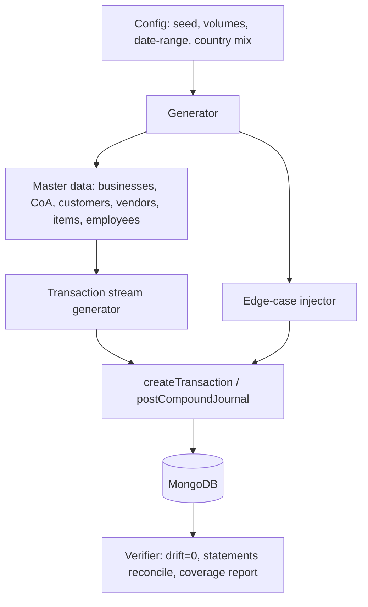

# 05 — Dataset Generator Specification

| | |
|---|---|
| **Status** | Design (generator not yet built) |
| **Version** | 1.0.0 |
| **Owner of** | Synthetic ERP dataset design + coverage matrix |
| **Last updated** | 2026-07-01 |
| **Parent** | [00_MASTER_PLAN.md](./00_MASTER_PLAN.md) |

> This document **designs** a deterministic synthetic-data generator that stress-tests the accounting engine at scale and across edge cases. It does not generate data. Output must obey every invariant in [01](./01_ACCOUNTING_ENGINE_SPECIFICATION.md); the generator is a *client* of the pipeline, never a back door into the ledger.

---

## 1. Purpose & scope

Produce large, realistic, reproducible datasets to (a) validate correctness at volume, (b) exercise the Edge Case Library ([08](./08_EDGE_CASE_LIBRARY.md)), (c) benchmark performance ([11](./11_PERFORMANCE_AND_SCALABILITY.md)), and (d) feed AI/forecasting training. Scope: the generator's architecture, entity volumes, relationship rules, output formats, and coverage matrix. Existing precedent: `scripts/seedCodeHubDemo.js` seeds one demo business ("Code Hub Solutions"); this generator generalizes and scales that.

## 2. Design principles

1. **Deterministic.** Seeded PRNG → identical output for a given seed (reproducible bug reports).
2. **Pipeline-faithful.** Financial rows are created **through** `createTransaction`/`postCompoundJournal`, not inserted raw — so generated data is provably valid, not merely plausible.
3. **Referentially complete.** Every FK resolves; every document has a party; every payment allocates to a real invoice/bill.
4. **Invariant-preserving.** Post-generation, `computeDrift` MUST return 0 and every statement MUST reconcile.
5. **Configurable scale.** Volumes are parameters; a "smoke" profile (hundreds) and a "scale" profile (100k+) share one generator.
6. **Coverage-driven.** The generator guarantees at least one instance of every transaction type and edge case.

## 3. Target volumes (scale profile)

| Entity | Target | Notes |
|---|---|---|
| Businesses | 1–10 | Multi-tenant isolation testing |
| Chart of accounts | 82 / business | Seeded defaults + a few custom |
| Customers | 5,000 | Realistic name/contact distribution |
| Vendors | 1,000 | Incl. WHT-enabled + non-filer subsets |
| Employees | 500 | Versioned salary structures |
| Inventory items | 1,000 | Weighted-avg + FIFO mix |
| Journal entries / transactions | 100,000+ | Spread across ≥3 fiscal years |
| Invoices | ~30,000 | Cash + credit, various states |
| Bills | ~20,000 | Incl. PO→GRN→Bill chains |
| Purchase orders | ~8,000 | With partial receipts |
| Payments | ~40,000 | Full/partial/overpayment |
| Installment plans | ~1,000 | Reducing-balance + flat |
| Fixed assets | ~300 | Both depreciation methods |
| Tax returns | per period | Across enabled tax countries |
| Currencies | ≥3 | Base + ≥2 foreign (FX gain/loss) |
| Banks | CoA cash accounts | Multiple 10xx accounts |

## 4. Architecture

Modules:
- **Config loader** — seed, per-entity volumes, fiscal date range, tax-country mix, currency mix, edge-case density.
- **Master-data builder** — creates businesses (with tax/approval/AI settings variants), seeds CoA, generates parties/items/employees with realistic distributions (Pareto for balances, long-tail for SKUs).
- **Transaction-stream generator** — emits a temporally-ordered event stream (issue → receive → invoice → pay → reconcile → period-close) respecting business calendars.
- **Edge-case injector** — deliberately seeds each Edge Case Library scenario at configurable density.
- **Verifier** — after generation runs `computeDrift`, statement reconciliation, and produces a coverage report.

## 5. Relationship & integrity rules

- Every Invoice → a Customer of the same business; every Bill → a Vendor.
- Every Payment allocation → an open Invoice/Bill's recognition JE; Σ allocations ≤ payment amount; overpayment → advance.
- Every PO → GRN(s) → Bill(s) within tolerance; some chains intentionally breach tolerance (edge case).
- Every installment plan → a financing JE; schedule sums to principal + interest.
- Foreign-currency documents settle at rates that produce non-zero FX gain/loss in a controlled fraction.
- Dates fall inside OPEN periods except the subset that targets period-lock rejection.

## 6. Output formats

The generator supports two sinks:

1. **Live pipeline (primary).** Calls services directly against a test database — the authoritative, invariant-safe path. Used for correctness/perf runs.
2. **Portable fixtures (secondary).** Exports CSV + JSON for external inspection and seeding without a live app.

### 6.1 CSV structure (portable)

One file per entity with a stable header. Illustrative:

`accounts.csv`: `businessId,accountCode,accountName,accountType,accountSubtype,normalBalance,isControlAccount`
`customers.csv`: `businessId,customerId,fullName,email,creditLimit,paymentTerms`
`invoices.csv`: `businessId,invoiceId,invoiceNumber,customerId,issueDate,dueDate,state,subtotal,totalTax,totalAmount,currencyCode`
`invoice_lines.csv`: `invoiceId,lineNo,itemId,qty,unitPrice,discount,taxRate,lineTotal`
`journal_entries.csv`: `businessId,journalEntryId,transactionDate,transactionType,amount,currencyCode,exchangeRate,baseCurrencyAmount,status,transactionSource`
`journal_lines.csv`: `journalEntryId,lineNo,accountCode,type,amount,costCenterCode`
`payments.csv`: `businessId,paymentId,paymentNumber,direction,partyId,amount,method`
`payment_allocations.csv`: `paymentId,documentType,documentId,parentJournalEntryId,amount`

### 6.2 SQL structure (portable)

Mirror of the CSVs as `CREATE TABLE` + `INSERT`, with declared PKs/FKs so an external relational tool can validate referential integrity independently of MongoDB. This is a *validation aid*, not the runtime schema.

- **Primary keys:** each entity's `<entity>Id`.
- **Foreign keys:** `journal_lines.accountCode → accounts`, `invoice_lines.invoiceId → invoices`, `payment_allocations.parentJournalEntryId → journal_entries`, etc.

## 7. Coverage matrix (must-hit)

The generator guarantees ≥1 instance of each, tracked in the coverage report:

| Category | Items |
|---|---|
| Sales | Cash Sale, Credit Sale, Inventory Sale, Payment Received, Advance, Refund, Sales Return |
| Purchases | Cash/Credit/Inventory Purchase, Payment Made, Prepaid |
| Procurement | PO, partial GRN, full GRN, 3-way matched Bill, over-billed, under-received, duplicate |
| Credits | Credit Note (partial/full), Vendor Credit (all reasons) |
| Payments | Full, partial, overpayment/advance, multi-document allocation, void |
| Tax | GST/VAT output, input tax, WHT, reverse charge, per country (PK/AE/SA/IN/US/GB) |
| FX | Foreign AR/AP, realized gain, realized loss, unrealized revaluation |
| Payroll | Run with EOBI/PF/WHT, reversal |
| Assets | Straight-line + declining-balance depreciation, disposal gain/loss |
| Financing | Installment (reducing/flat), penalty, restructure, early settlement, loan |
| Period | Month/year close, opening balance, adjusting (accrual/deferral) |
| Reversal | Reverse each major type |
| Edge cases | Every entry in [08](./08_EDGE_CASE_LIBRARY.md) |

## 8. Business rules

| ID | Rule |
|---|---|
| DG-01 | Financial rows are created through the pipeline, never inserted raw. |
| DG-02 | Same seed ⇒ identical dataset. |
| DG-03 | Post-generation drift MUST be 0 and statements MUST reconcile. |
| DG-04 | Every FK resolves; every payment allocates to a real document. |
| DG-05 | Coverage report lists every category/edge case with counts. |
| DG-06 | Edge-case density is configurable and defaults to non-zero. |

## 9. Acceptance criteria

- [ ] A scale run (100k+ JEs) completes and `computeDrift` returns `balanced:true, totalAbsDrift:0`.
- [ ] Trial Balance, Balance Sheet, and P&L reconcile on the generated set.
- [ ] Coverage report shows ≥1 of every catalog item and edge case.
- [ ] Re-running with the same seed produces byte-identical portable fixtures.
- [ ] The SQL export's FK constraints load without violation in an external RDBMS.

## 10. Failure modes

| Failure | Cause | Mitigation |
|---|---|---|
| Drift after generation | Raw insert bypassing pipeline | DG-01 enforcement |
| Non-reproducible output | Unseeded randomness | Central seeded PRNG (DG-02) |
| Orphan document | Party/item not created first | Master-data-first ordering |
| Coverage gap | Missing scenario | Coverage report gate (DG-05) |

## 11. Regression / 12. Implementation guidance

Build incrementally: master-data builder → single-type transaction generators (reuse pipeline) → edge-case injector → verifier/coverage report → scale tuning (batch through `batchPosting` with the recovery pass). Keep the generator in `scripts/` alongside `seedCodeHubDemo.js`; parameterize via a config file.

## 13. Performance notes

At 100k+ entries, generate through `batchPosting.postBatch` with bounded concurrency and the sequential recovery pass to avoid WriteConflicts on Atlas; disable fire-and-forget RAG reindex during bulk generation and reindex once at the end.

## 14. Security notes

Synthetic data only — never seed a production tenant. Use a clearly-namespaced test database. No real PII.

## 15. Future expansion

Industry-flavoured profiles (retail, services, manufacturing) once those verticals exist; anomaly-injection profiles for fraud-detection training; multi-year seasonality for forecasting.

## 16. Cross references

[01](./01_ACCOUNTING_ENGINE_SPECIFICATION.md) · [06_VALIDATION_ENGINE.md](./06_VALIDATION_ENGINE.md) · [08_EDGE_CASE_LIBRARY.md](./08_EDGE_CASE_LIBRARY.md) · [11_PERFORMANCE_AND_SCALABILITY.md](./11_PERFORMANCE_AND_SCALABILITY.md)

## 17. Revision history

| Version | Date | Change |
|---|---|---|
| 1.0.0 | 2026-07-01 | Initial design; generator not yet implemented. |

## 18. Progress checklist

- [x] Volumes + coverage matrix defined
- [x] Pipeline-faithful architecture
- [x] CSV + SQL portable formats
- [ ] Generator implemented in `scripts/`
- [ ] Verifier + coverage report implemented
