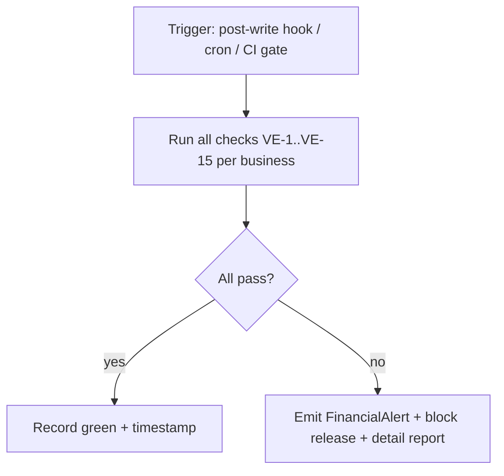

# 06 — Validation Engine

| | |
|---|---|
| **Status** | Partially implemented (drift + report reconciliation live; unified harness planned) |
| **Version** | 1.0.0 |
| **Owner of** | Self-verification of ledger, balances, and report invariants |
| **Last updated** | 2026-07-01 |
| **Parent** | [00_MASTER_PLAN.md](./00_MASTER_PLAN.md) |

> The validation engine answers one question continuously: **"Does the system still tell the truth?"** It cross-checks every derived figure against its source of truth and fails loudly on any discrepancy.

---

## 1. Purpose & scope

Specify the checks that verify VousFin's financial integrity independent of the code that produced the data. Two layers: (a) **write-time validation** inside the pipeline (already covered by [04](./04_TRANSACTION_LIFECYCLE.md)); (b) **post-hoc verification** — the subject of this document — that re-derives every projection from its source and asserts equality. Existing live components: `ledgerIntegrity.service` (drift), report reconciliation in report services, `consistencyVerification.service`, `arApReconciliation.service`, `arApIntegrity` routes.

## 2. Definitions

| Term | Meaning |
|---|---|
| **Source of truth** | Owner document (JournalEntry, Invoice, InventoryItem). |
| **Projection** | Derived cache (runningBalance, party balance, aging). |
| **Reconcile** | Re-derive projection from source; assert equality within tolerance (0.01). |
| **Integrity gate** | A CI/manual gate that fails the build if any invariant breaks. |

## 3. What must be validated

| # | Invariant | Source vs projection | Live check |
|---|---|---|---|
| VE-1 | Trial balance balances | Σ debits == Σ credits | `computeDrift.balanced` |
| VE-2 | Running-balance drift = 0 | journal-derived vs cached | `ledgerIntegrity.computeDrift` |
| VE-3 | Customer balance | Σ open invoices − payments vs `currentReceivableBalance` | `arApReconciliation` |
| VE-4 | Vendor balance | Σ open bills − payments vs `currentPayableBalance` | `arApReconciliation` |
| VE-5 | AR sub-ledger + control attribution | Σ customer balances vs customer-linked ledger; 1110 unattributed remainder | `ledgerIntegrity.computeArApSubledgerDrift` (live; in gate + drift script) |
| VE-6 | AP sub-ledger + control attribution | Σ vendor balances vs vendor-linked ledger; 2110 unattributed remainder | `ledgerIntegrity.computeArApSubledgerDrift` (live) |
| VE-7 | Inventory valuation | Σ item (qty × cost) vs GL 1150 balance | `inventoryRecalc` |
| VE-8 | Balance Sheet balances | Assets == Liabilities + Equity | report reconciliation |
| VE-9 | P&L ties to ledger | Σ revenue − expense == net income | report service |
| VE-10 | Cash Flow ties | ΔCash == net cash flows | report service |
| VE-11 | Aging ties to AR/AP | Σ aging buckets == total outstanding | `arApReporting` |
| VE-12 | Tax payable ties | GL tax accounts vs computed tax positions | `taxPosition` |
| VE-13 | Period lock respected | no non-system entries in CLOSED/LOCKED | audit scan |
| VE-14 | Immutability respected | no financial-field mutation on posted JEs | audit scan |
| VE-15 | Tenant isolation | no cross-`businessId` refs | isolation scan |

## 4. Architecture (unified harness — planned)

- **Per-business scope.** Every check runs per tenant.
- **Tolerance.** Monetary equality to 0.01 (2 dp); zero tolerance for drift and balance.
- **Outputs.** A structured report per business `{check, source, projected, delta, pass}`; failures raise `FinancialAlert` and (in CI) fail the integrity gate.
- **Existing entry point.** `scripts/run-integrity-gate.js` (`npm run test:integrity`) is the seed of this harness; extend it to cover VE-3…VE-15.

## 5. Write-time vs post-hoc

- **Write-time** (fast, per request): balance check, account tenancy, period lock, tax clamp, over-application guards. Prevents bad data entering.
- **Post-hoc** (comprehensive, batched): full reconciliation of every projection. Catches drift from crashes, out-of-band edits, or logic bugs that slipped write-time checks.

Both are required; neither replaces the other.

## 6. Business rules

| ID | Rule |
|---|---|
| VE-R1 | Every projection is reconciled against its source, not trusted. |
| VE-R2 | Drift and balance checks have zero tolerance. |
| VE-R3 | A failed check blocks release and raises an alert. |
| VE-R4 | Checks are tenant-scoped and idempotent (read-only). |
| VE-R5 | The verifier never mutates financial data (repair is a separate, snapshotted script). |

## 7. Acceptance criteria

- [ ] Running the harness on a healthy dataset reports all VE-1…VE-15 green.
- [ ] Injecting an out-of-band balance edit is caught by VE-2 (drift).
- [ ] Injecting a cross-tenant ref is caught by VE-15.
- [ ] A statement that fails to reconcile blocks the integrity gate.
- [ ] The harness is read-only (no data mutated).

## 8. Failure modes

| Failure | Cause | Detection |
|---|---|---|
| Silent drift | crash mid-post | VE-2 |
| Party-balance divergence | direct edit | VE-3/VE-4 |
| Control vs subledger gap | missing reconcile | VE-5/VE-6 (planned) |
| Inventory/GL divergence | stock edit outside pipeline | VE-7 |
| Report ≠ ledger | report stores state | VE-8…VE-11 |

## 9. Regression requirements

Every accounting-affecting change runs the harness (at minimum VE-1, VE-2 via `scripts/ledgerDrift.js`) and must show green. New projections add their own VE-N reconcile check + test.

## 10. Implementation guidance

Extend `run-integrity-gate.js` to invoke each check module, aggregate results, and exit non-zero on any failure. Reuse `ledgerIntegrity`, `arApReconciliation`, `inventoryRecalc`, `taxPosition`, and report services rather than re-deriving math. Wire into CI (currently manual — see Doc 10 §gaps).

## 11. Performance notes

Post-hoc checks use aggregation pipelines (`$group`) and `.lean()`; run on a schedule or pre-release, not per request. Large tenants may check incrementally (since-last-green watermark).

## 12. Security notes

Read-only; requires elevated/internal invocation; results may reveal financial totals so gate them behind admin/internal access. Repair scripts are separately privileged and snapshot before mutating.

## 13. Future expansion

Continuous background verification with watermarks; anomaly detection on drift trends; a public "integrity badge" per tenant (last-verified timestamp).

## 14. Cross references

[01](./01_ACCOUNTING_ENGINE_SPECIFICATION.md) §11 · [09_REPORTING_ENGINE.md](./09_REPORTING_ENGINE.md) · [10_TESTING_STRATEGY.md](./10_TESTING_STRATEGY.md) · [07_SELF_IMPROVEMENT_ENGINE.md](./07_SELF_IMPROVEMENT_ENGINE.md)

## 15. Revision history

| Version | Date | Change |
|---|---|---|
| 1.0.0 | 2026-07-01 | Initial spec; unifies live drift/reconcile checks into a VE-1…VE-15 harness. |

## 16. Progress checklist

- [x] Invariant catalog (VE-1…VE-15)
- [x] Write-time vs post-hoc split
- [ ] Unified harness (`run-integrity-gate` extended)
- [x] Control-vs-subledger reconcile (VE-5/VE-6) — `computeArApSubledgerDrift`, in gate + drift script
- [ ] CI wiring
