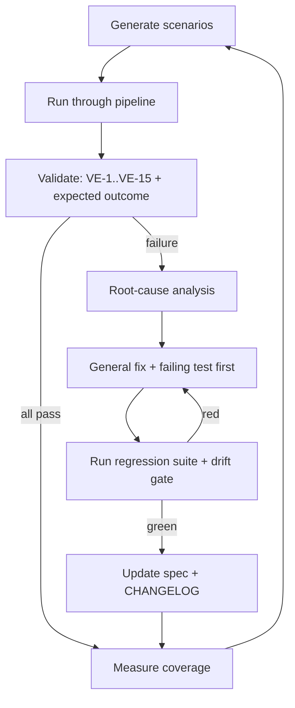

# 07 — Self-Improvement Engine

| | |
|---|---|
| **Status** | Design (workflow) |
| **Version** | 1.0.0 |
| **Owner of** | The scenario → fail → root-cause → fix → regress loop |
| **Last updated** | 2026-07-01 |
| **Parent** | [00_MASTER_PLAN.md](./00_MASTER_PLAN.md) |

> A disciplined, repeatable loop that hardens the accounting engine by generating scenarios, running them, finding failures, fixing **root causes** (never symptoms), and locking the fix with a regression test. This is a *process*, executed by humans or AI agents; it is not a runtime service that patches production.

---

## 1. Purpose & scope

Define the improvement loop and its guardrails so quality increases monotonically and every fix is general, tested, and permanent. Scope: the methodology, its inputs (dataset generator, edge-case library), and its outputs (fixes + regression tests + doc updates). It reuses the validation engine ([06](./06_VALIDATION_ENGINE.md)) as the failure oracle.

## 2. The loop

1. **Generate** — pull scenarios from the dataset generator ([05](./05_DATASET_GENERATOR_SPECIFICATION.md)) and edge-case library ([08](./08_EDGE_CASE_LIBRARY.md)).
2. **Run** — execute through the real pipeline (no back doors).
3. **Validate** — apply the validation engine + each scenario's expected outcome.
4. **Root-cause** — for any failure, trace to the underlying business-rule or architectural defect using systematic debugging (form hypotheses, add instrumentation, bisect). No guess-patching.
5. **Fix** — write a failing test that reproduces the bug (TDD), then the minimal **general** fix. Never special-case the failing input.
6. **Regress** — run the full suite + `ledgerDrift` (must be 0). Fix must not break other invariants.
7. **Document** — update the owning spec and CHANGELOG.
8. **Measure** — record coverage/pass-rate; repeat.

## 3. Guardrails (non-negotiable)

| ID | Rule | Rationale |
|---|---|---|
| SI-01 | No hard-coded fixes for a single input/customer/report | Master Plan Principle 5 (generalize) |
| SI-02 | Every fix starts with a failing regression test | TDD; proves the bug and prevents recurrence |
| SI-03 | Root cause, not symptom | Master Plan Principle 3 |
| SI-04 | Fix must keep drift = 0 and all VE checks green | Correctness first |
| SI-05 | Never weaken a test or invariant to make a fix pass | Integrity over convenience |
| SI-06 | Scope the diff; one root cause per change | Reviewability |
| SI-07 | Document the fix + decision in CHANGELOG | Explainability |

## 4. Inputs & oracles

- **Scenario sources.** Dataset generator (volume + realistic mixes), edge-case library (adversarial), production incident reports (real failures become permanent scenarios).
- **Failure oracle.** Validation engine (VE-1…VE-15) plus per-scenario expected outcomes (e.g., "posting into a locked period must 423").
- **Root-cause aids.** Structured logs, the audit trail (before/after states), the drift report (which account, how much), and reversal/idempotency traces.

## 5. Root-cause taxonomy

| Class | Example | Typical fix |
|---|---|---|
| Business-rule gap | AR/AP misclassified by type label | Detect by account pair (general rule) |
| Atomicity gap | Balance updated but JE not (or vice versa) | Wrap in `withTransaction` |
| Idempotency gap | Retry double-posts | Add idempotency key |
| Concurrency gap | WriteConflict lost row | Sequential recovery pass |
| Validation gap | Over-application allowed | Add cap check + test |
| Projection staleness | Report shows old total | Cache invalidation on write |
| Isolation gap | Cross-tenant ref | Tenant validation |

These map to real fixes already shipped (AR/AP account-pair detection, `withTransaction`, idempotency keys, batch recovery pass, over-application guards) — the loop institutionalizes that pattern.

## 6. Business rules

Covered by the guardrails (SI-01…SI-07). Additionally: incident-derived scenarios are added to the permanent library so the same failure can never regress silently.

## 7. Acceptance criteria

- [ ] A seeded failure is reproduced by a new failing test before any fix.
- [ ] The fix is general (removing the special input still passes).
- [ ] Full suite + drift gate green after the fix.
- [ ] The scenario is added to the permanent library.
- [ ] Spec + CHANGELOG updated.

## 8. Failure modes (of the loop itself)

| Failure | Cause | Mitigation |
|---|---|---|
| Whack-a-mole fixes | Patching symptoms | SI-03 root-cause requirement |
| Silent regression | Weakened test | SI-05 no-weakening rule |
| Overfit fix | Special-cased input | SI-01 generalization rule |
| Undocumented change | Skipped step 7 | Release gate requires CHANGELOG (Doc 13) |

## 9. Regression requirements

The loop **is** the regression discipline. Every pass appends to the suite; the suite is run in full before release (Doc 10).

## 10. Implementation guidance

Run the loop against a disposable test database seeded by the generator. Use the systematic-debugging discipline (reproduce → isolate → hypothesize → verify → fix → confirm). Keep each iteration's diff small and its intent single.

## 11. Performance / 12. Security notes

Runs offline against test data; never mutates production. Any repair applied to real data uses the snapshotted, drift-verified repair scripts, not this loop directly.

## 13. Future expansion

An agent-driven variant (autonomy layer) could propose fixes as `ProposedAction`s for human approval, but production application always stays behind the approval + integrity gates — the loop never auto-merges accounting changes.

## 14. Cross references

[05](./05_DATASET_GENERATOR_SPECIFICATION.md) · [06_VALIDATION_ENGINE.md](./06_VALIDATION_ENGINE.md) · [08_EDGE_CASE_LIBRARY.md](./08_EDGE_CASE_LIBRARY.md) · [10_TESTING_STRATEGY.md](./10_TESTING_STRATEGY.md) · [14_AI_DEVELOPMENT_GUIDELINES.md](./14_AI_DEVELOPMENT_GUIDELINES.md)

## 15. Revision history

| Version | Date | Change |
|---|---|---|
| 1.0.0 | 2026-07-01 | Initial loop specification with guardrails + root-cause taxonomy. |

## 16. Progress checklist

- [x] Loop defined with oracle + guardrails
- [x] Root-cause taxonomy mapped to real fixes
- [ ] Loop wired to generator + gate as one command
