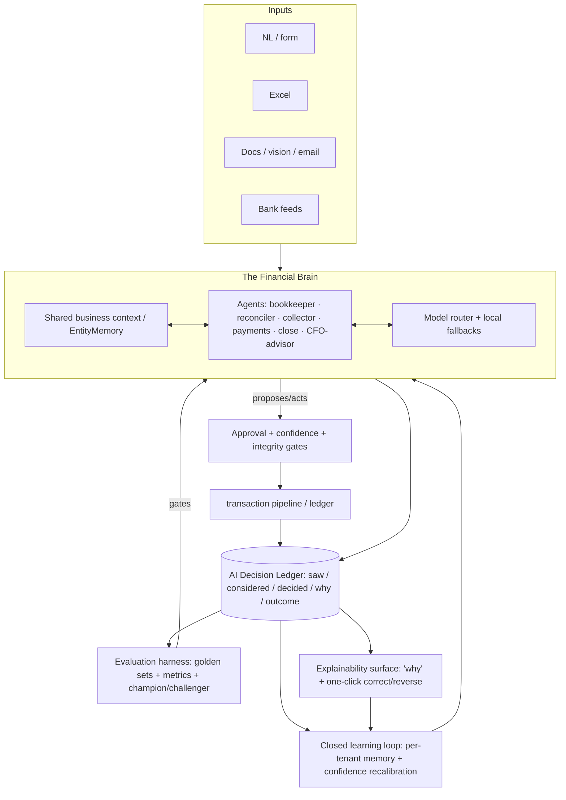

# VousFin Intelligence Roadmap — "The Financial Brain"

| | |
|---|---|
| **Type** | Design spec / strategic roadmap |
| **Date** | 2026-07-01 |
| **Status** | Proposed (awaiting review → writing-plans) |
| **Author** | VousFin engineering |
| **Related** | `docs/plans/` constitution (00–14), esp. [01 Accounting Engine], [04 Transaction Lifecycle], [06 Validation Engine], [07 Self-Improvement], [12 Security], [14 AI Development] |

> **Goal:** make VousFin the smartest, most intelligent accounting tool in the world — an explainable, continuously-learning, controlled-autonomy **financial brain** that runs a business's day-to-day accounting straight-through, keeps the books continuously correct, explains every decision, learns from every correction, and proactively advises — **without ever trading accounting integrity or human oversight.**

---

## 1. Why this, why now

The 2026 market has moved from AI *copilots* to *controlled-autonomy agents*: a majority of finance leaders are now budgeting for autonomous finance agents rather than assistants. The winning pattern is **"audit-ready AI"** — agents that *act* (match a bill, apply cash, flag fraud, post an entry) while exposing a **reasoning trace / decision lineage** for every action, feeding a **continuous close** (real-time, always-current books) instead of a monthly scramble. Reported outcomes at maturity: ~95% straight-through cash application, 50–80% less repetitive journal effort, close cycles halved.

**VousFin is already ahead of most tools.** It has: the NL parser with tiered auto-post (98/95/<95), RAG assistant + command bar, anomaly detection (isolation forest), a full forecasting suite (LSTM/ETS/ensemble + drift + champion/challenger governance), a **policy-governed autonomy layer** (agents: bookkeeper/reconciler/collector/payments/close; autonomy dials observe→suggest→copilot→autopilot; proposed actions; orchestrator; NL control line), tax autopilot, vendor risk, benchmarking, and proactive insights.

So "smartest in the world" is **not** about scattering new features. It is about **deepening and connecting what exists into one coherent, explainable, continuously-learning brain**, and closing the specific gaps versus the 2026 benchmark:

1. **Decision lineage / explainability** — VousFin audits *state changes*, not *AI reasoning*. No unified record of what each AI decision saw, considered, and why.
2. **A true closed learning loop** — corrections aren't systematically captured and fed back to improve per-tenant accuracy.
3. **Straight-through-processing measurement** — no north-star metric for how much runs itself.
4. **Continuous close** — the pieces exist but aren't unified into always-current books.
5. **Evaluation discipline for all AI** — forecasting has governance (champion/challenger, drift); the rest of the AI does not.

## 2. Design principles (inherited + reinforced)

These bind every phase. They come from the `docs/plans/` constitution and are non-negotiable.

| # | Principle |
|---|---|
| P1 | **Correctness > Performance > Convenience.** AI never fabricates accounting; every AI action posts through the existing pipeline + gates ([04]). Drift stays 0. |
| P2 | **Explainability is a first-class output**, produced with the action, not reconstructed after. |
| P3 | **Every autonomous action is reversible, audited, and tenant-isolated.** |
| P4 | **Learning is closed-loop and measured** — no unmeasured "it feels smarter." |
| P5 | **Controlled autonomy** — per-capability dials; autonomy is *earned* by measured accuracy, never assumed. |
| P6 | **Eval-gated releases** — no model/prompt/agent ships without passing the evaluation harness. |
| P7 | **Privacy by construction** — per-tenant learning stays per-tenant; only non-sensitive catalog/help learns globally (the existing `scope` + sentinel pattern). |
| P8 | **Cheapest-model-that-meets-the-bar** — the model router picks the least-cost model that passes the accuracy gate; deterministic local fallbacks always exist. |

## 3. Architecture at a glance

Two new cross-cutting substrates (Phase 0) make everything else possible: the **AI Decision Ledger** (lineage + training signal) and the **Evaluation Harness** (measured, gated quality). Everything downstream reads/writes them.

## 4. The phases

Each phase: **Goal · Build · Reuses (what already exists) · Deliverables · Success metric · Guardrails.** Sequenced so each unlocks the next.

### Phase 0 — AI Decision Ledger + Evaluation Harness *(foundation)*

- **Goal.** Give every AI action an auditable lineage and give every AI change a measured quality gate.
- **Build.**
  - `AIDecision` append-only model: `{businessId, kind (parse|classify|match|reconcile|autopost|anomaly|forecast|recommend), inputsSummary, candidates[], decision, confidence, model, promptVersion, outcome (pending|accepted|corrected|reversed), correctedTo, linkedEntityId, createdAt}`. Tenant-scoped, immutable, retention-governed.
  - A thin `aiDecision.service.record()` called from every AI path (NL parse, Excel classify, bill match, bank reconcile, auto-post, anomaly verdict, forecast, recommendation).
  - **Evaluation harness**: golden datasets per capability + metrics (parse/categorization accuracy, match precision/recall, reconcile accuracy, forecast MASE/MAPE, anomaly precision/recall). A `npm run eval` that scores current vs. champion and blocks regressions — generalizing the *forecasting* champion/challenger + drift discipline to **all** AI.
- **Reuses.** `forecasting/championChallenger + drift + governance` (pattern), `EventLog`/`AuditLog` (append-only pattern), `faithfulnessJudge` (RAG scoring), `modelRegistry`.
- **Deliverables.** `AIDecision` model + service; instrumentation of existing AI paths; eval harness + golden sets; an admin "AI Decisions" view.
- **Success metric.** 100% of AI actions produce an `AIDecision`; eval harness runs in CI and gates changes.
- **Guardrails.** Ledger is read-only after write; no sensitive raw data stored beyond a summary; tenant-scoped.

### Phase 1 — The Closed Learning Loop *(self-improving brain)*

- **Goal.** The more a business uses VousFin, the smarter it gets **for that business**.
- **Build.**
  - Corrections captured in Phase 0 become labeled signals. A per-tenant **learned-preference store**: counterparty→account defaults ("AWS"→Software Subscriptions), category patterns, recurring-transaction detection, payment-terms defaults, tax treatment defaults.
  - Feed learned preferences into the NL parser's account resolution and the Excel classifier **before** the LLM, so deterministic learned mappings beat guesses.
  - **Confidence recalibration**: use the real accept/correct rate per tenant+category to adjust the effective auto-post/confirm thresholds (so 98/95 reflect *measured* accuracy, not a static constant).
  - Deepen `EntityMemory` into a per-business knowledge graph (vendors, customers, accounts, conventions).
- **Reuses.** `EntityMemory`, `accountMatcher` (learned overrides slot in ahead of fuzzy), `confidenceCalculator`, `nlParser`, `feedback`/`userFeedback` services.
- **Deliverables.** Learned-preference store + service; resolver integration; recalibration job; "VousFin learned X from your correction" UX.
- **Success metric.** User-correction rate trends down over time; auto-post % trends up at constant reversal rate.
- **Guardrails.** Learning is per-tenant (P7); a learned mapping never overrides an explicit user choice; every learned rule is inspectable and deletable.

### Phase 2 — Explainability Everywhere *(trust to dial up autonomy)*

- **Goal.** Every AI number, match, verdict, and auto-post carries a grounded plain-language "why."
- **Build.**
  - A `explain(decisionId)` surface that renders the Phase-0 lineage as plain language: *"This bill auto-matched PO-123 because quantity and unit price agree within 5% and the vendor matches; duplicate check passed."*
  - Faithfulness-checked (no hallucinated rationale) via `faithfulnessJudge`.
  - One-click **correct / reverse** on any AI decision, wired straight into Phase 1's learning and the existing reversal path.
- **Reuses.** `narrative` (plain-language), `faithfulnessJudge`, `reverseTransaction`, `proactiveInsights`.
- **Deliverables.** Explain endpoint + component; "review AI decision" surface; correction wiring.
- **Success metric.** % of AI actions with a complete, faithful explanation → 100%.
- **Guardrails.** Explanations are grounded in the actual decision inputs; plain language per the product-copy rule (no jargon as primary text).

### Phase 3 — Continuous Close & Straight-Through Processing

- **Goal.** Always-current books; measured, ever-increasing automation depth.
- **Build.**
  - **STP scorecard**: auto-post %, auto-match %, auto-reconcile %, auto-categorize % — the north-star metrics, per tenant, trending.
  - **Continuous reconciliation**: bank + AR/AP reconciled as data arrives, not at close; continuous controls (every transaction checked against control criteria as it posts, explained when it trips).
  - **Autonomous month-end close**: deepen `closeAgent` into a close checklist with auto-adjusting entries (accruals/deferrals/depreciation already exist), variance explanations, and a **close-readiness score**; one-click (gated) close.
- **Reuses.** `closeAgent`, `reconciler`, `bankReconciliation`, `arApReconciliation`, `trendMonitor` (→ continuous controls), `recognitionSchedule`, scheduled depreciation (just shipped), `accountingPeriod`.
- **Deliverables.** STP scorecard; continuous-reconcile jobs; close-readiness workflow.
- **Success metric.** STP rates trend up; close-cycle time down; books provably current (drift 0 continuously).
- **Guardrails.** Close respects period locks; every auto-adjusting entry is explained + reversible.

### Phase 4 — Proactive AI CFO / Advisory Brain

- **Goal.** Always-on, decision-ready guidance — the "what should I do next" layer.
- **Build.**
  - Continuous monitoring → ranked, explainable, **executable** recommendations: cash runway, working-capital levers (DSO/DPO), margin erosion, liquidity/covenant alerts, spend anomalies.
  - **Conversational what-if**: "can I afford to hire two people?" → grounded projection using the forecasting + scenario engines.
  - **Benchmark-driven advice**: "COGS % is 8pts above sector median — concentrated in freight; here's the trend."
  - Recommendations execute through the approval gate (one click → proposed action → post).
- **Reuses.** `proactiveInsights`, `financialIntelligence`, `businessHealth`, `cashFlowForecast`/`thirteenWeekCashFlow`, `scenarioModeler`, `benchmarking`, `breakEven`, `commandCenter`.
- **Deliverables.** Advisor feed (ranked + explainable + executable); conversational what-if; benchmark recommendations.
- **Success metric.** % of recommendations acted on; measurable working-capital/runway improvement.
- **Guardrails.** Advice is grounded in the tenant's real figures; VousFin is not a licensed advisor — framing stays "here's what your numbers say," not personalized investment advice.

### Phase 5 — Deep Multi-Modal Ingestion *(feed the brain)*

- **Goal.** Turn any real-world financial artifact into structured, explained, posted accounting automatically.
- **Build.**
  - Vision/OCR for any document: receipts, invoices, bank statements, contracts → structured extraction → the pipeline (with confidence tiers + explanation).
  - **Email-forward capture**: forward a bill → captured, extracted, matched, queued.
  - Bank feeds / statement parsing (OFX/MT940 already parsed) → continuous bank data into Phase 3.
- **Reuses.** `AIClassifyPanel` + ingestion gateway, Gemini vision (already used in `parseTransactionFromImage`), `ofxParser`/`mt940Parser`, `bankReconciliation`.
- **Deliverables.** Generalized document-ingestion pipeline; email intake; bank-feed connectors (where card-free feasible).
- **Success metric.** % of source documents captured without manual entry; extraction accuracy (measured via Phase 0).
- **Guardrails.** Extracted data is never posted un-gated; low-confidence extractions are held for review (the Excel-tier pattern).

### Phase 6 — The Unified Financial Brain *(orchestration + agentic depth)*

- **Goal.** One brain: shared context, collaborating agents, natural-language control, autonomy that earns its dial-ups.
- **Build.**
  - A **shared business context** all agents read/write (single AI source of business truth), built on `EntityMemory` + Phase 1's learned store.
  - **Cross-agent orchestration**: the reconciler flags a mismatch → the collector adjusts dunning → the CFO advisor updates the cash forecast — each step logged in the Decision Ledger.
  - **NL control line** matured (`nlControl` exists): "close the month," "chase everyone over 60 days," "categorize last week's card spend" → planned, previewed, executed under policy.
  - **Autonomy maturation**: when a capability's measured accuracy (Phase 0) crosses a threshold, VousFin *recommends* dialing it up (suggest→copilot→autopilot); the user always decides.
- **Reuses.** `orchestrator`, `commandCenter`, `autonomyPolicy`, `nlControl`, `planRun`, `proposedAction`, all agent services.
- **Deliverables.** Shared context layer; orchestration flows; matured NL control; autonomy-recommendation engine.
- **Success metric.** Multi-agent tasks complete end-to-end under policy with full lineage; autonomy dials rise as accuracy justifies.
- **Guardrails.** Every orchestrated action still passes the same gates; nothing auto-escalates autonomy without user consent.

## 5. Cross-cutting guardrails (apply to every phase)

- AI posts **only** through the existing pipeline + gates ([04]); never a side-door `JournalEntry.create`.
- Every autonomous action is reversible ([01] reversal), audited ([12]), tenant-isolated, and logged in the Decision Ledger.
- Releases are **eval-gated** (Phase 0); accounting-affecting AI changes are TDD + drift-verified ([10]).
- Confidence + amount-threshold gates remain independent layers ([04] §4).
- Cost/latency governed by the model router with deterministic local fallbacks.

## 6. The "smartest in the world" scorecard

| Metric | Direction | Source |
|---|---|---|
| Straight-through processing (auto-post/match/reconcile/categorize %) | ↑ | Phase 3 scorecard |
| Per-category AI decision accuracy | ↑ to target | AI Decision Ledger |
| User-correction rate | ↓ | Decision Ledger (learning working) |
| % AI actions with faithful explanation | → 100% | Phase 2 |
| Close-cycle time / books-current lag | ↓ | Phase 3 |
| Recommendations acted on; runway/working-capital improvement | ↑ | Phase 4 |
| Documents captured without manual entry | ↑ | Phase 5 |
| **Ledger drift** | **= 0 always** | integrity gate (non-negotiable) |

## 7. Sequencing rationale

Lead with **Phase 0 + 1 + 2** (explainable, self-improving brain) because: (a) it's the 2026 differentiator and the trust unlock — users only dial up autonomy they can *see* and *trust*; (b) the Decision Ledger + eval harness are prerequisites for measuring and improving *everything* after; (c) the learning loop compounds — the earlier it starts, the smarter VousFin becomes by the time later phases ship. Then **Phase 3** (continuous close/STP) turns trust into automation depth; **Phase 4** (CFO advisory) turns correct books into guidance; **Phase 5** (ingestion) feeds the brain more data; **Phase 6** (unification) ties it into one orchestrated, autonomy-earning brain.

Phases are independently valuable and shippable — each is its own spec → plan → implementation cycle. Phase 0 is the first to build.

## 8. Out of scope (for this roadmap)

Paid-infra dependencies (real-time streaming at scale, heavy vision workloads) are noted where a phase would benefit but are **deferred** per the user's decision to upgrade infra later. New verticals (repair/retail/warehouse) remain out of scope ([00] §10). This roadmap is intelligence, not infrastructure or new industries.

## 9. Risks & mitigations

| Risk | Mitigation |
|---|---|
| AI posts something wrong autonomously | Gates + reversibility + eval gating + drift = 0; autonomy earned, not assumed |
| Learning overfits / leaks across tenants | Per-tenant isolation (P7); inspectable/deletable learned rules |
| Explanations hallucinate | Faithfulness judge; grounded in actual decision inputs |
| Cost/latency of heavy models | Model router + local fallbacks; eval picks cheapest-that-passes |
| Scope creep across 7 phases | Each phase is its own spec→plan cycle; Phase 0 first |

## 10. Revision history

| Version | Date | Change |
|---|---|---|
| 1.0 | 2026-07-01 | Initial roadmap, research- and codebase-grounded. Leads with the explainable self-improving brain. |
